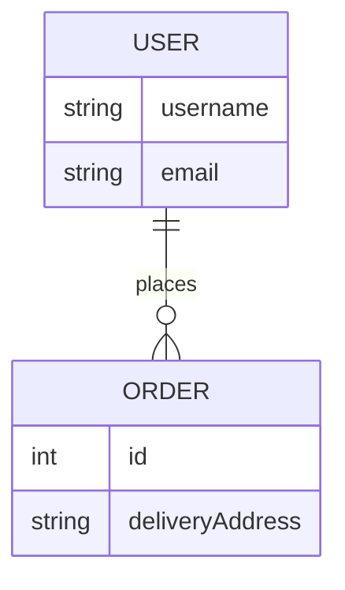

# Entity Relationship Diagram (ERD)

```mermaid
erDiagram
    USER ||--o{ ORDER : places
    USER {
        string username
        string email
    }
    ORDER {
        int id
        string deliveryAddress
    }
```
